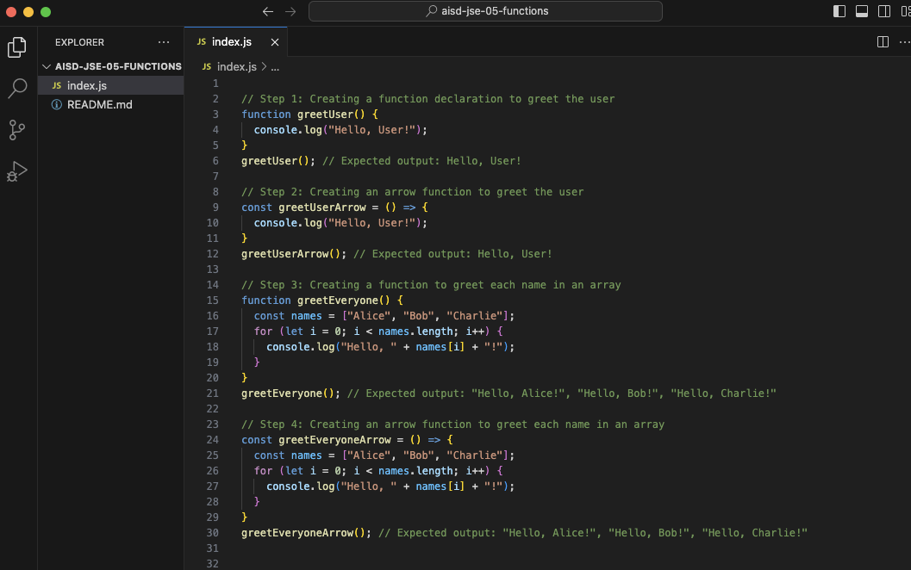

# JavaScript Basics: Functions and Scope


## Description 📄
In this project, you will explore the fundamentals of function declarations and arrow functions in JavaScript. You'll learn how to write functions, understand the difference between these two function types, and how they work in different contexts. Through practical examples, you’ll also use functions to loop over arrays and perform tasks. This hands-on activity will deepen your understanding of how functions help in automating repetitive tasks and organizing code effectively.

## Expected Project Structure 🏗️
Your project will have the following structure:
```
IntroToFunctions/
└── index.js
```


# Instructions ✅

## 1. **Create the Project Folder and File**
You will begin by setting up your project structure.

- [ ] Create a folder named `IntroToFunctions` to store your project files.
- [ ] Inside the `IntroToFunctions` folder, create a file named `index.js`. This file will contain all your JavaScript code.


## 2. **Create a Function Declaration**
You will start by creating a simple function declaration that greets the user.

```javascript
// Step 1: Creating a function declaration to greet the user
function greetUser() {
  console.log("Hello, User!");
}
greetUser(); // Expected output: Hello, User!
```

- [ ] Run your JavaScript file in the terminal with the command `node index.js` to see the output.

**Expected Output:**

```
Hello, User!
```

**Explanation:**
- **Syntax Breakdown**: 
  - `function greetUser() {}`: This defines a function named `greetUser`. The code inside the curly braces will run when the function is called.
  - `console.log("Hello, User!");`: This outputs the string `"Hello, User!"` to the console.
  - `greetUser();`: This calls the function, executing the code inside it.
- Function declarations in JavaScript are processed before any code is executed, which allows you to call the function even if it appears later in the code.


## 3. **Create an Arrow Function**
Next, you will rewrite the same function using arrow function syntax.

```javascript
// Step 2: Creating an arrow function to greet the user
const greetUserArrow = () => {
  console.log("Hello, User!");
}
greetUserArrow(); // Expected output: Hello, User!
```

- [ ] Run your JavaScript file in the terminal with the command `node index.js` to see the output.

**Expected Output:**
```
Hello, User!
```

**Explanation:**
- **Syntax Breakdown**:
  - `const greetUserArrow = () => {}`: This defines an arrow function and assigns it to the constant `greetUserArrow`.
  - `console.log("Hello, User!");`: The code inside the function that logs the greeting.
  - `greetUserArrow();`: This calls the arrow function.
- **Key Difference**: Arrow functions provide a shorter and simpler way to write functions. They’re useful when you want to quickly create a function without needing to write as much code as with a function declaration. In future lessons, you’ll see how arrow functions can be particularly helpful when working with something called "callbacks."


## 4. **Loop Over an Array with a Function**
You will now create a function that loops over an array of names and greets each name using a standard `for` loop.

```javascript
// Step 3: Creating a function to greet each name in an array
function greetEveryone() {
  const names = ["Alice", "Bob", "Charlie"];
  for (let i = 0; i < names.length; i++) {
    console.log("Hello, " + names[i] + "!");
  }
}
greetEveryone(); // Expected output: "Hello, Alice!", "Hello, Bob!", "Hello, Charlie!"
```

- [ ] Run your JavaScript file in the terminal with the command `node index.js` to see the output.

**Expected Output:**
```
Hello, Alice!
Hello, Bob!
Hello, Charlie!
```

**Explanation:**
- **Syntax Breakdown**:
  - `const names = ["Alice", "Bob", "Charlie"];`: This creates an array called `names` that holds three strings.
  - `for (let i = 0; i < names.length; i++) {}`: This loop iterates over each element of the `names` array. The `i` variable is the index, starting at 0, which corresponds to the first element in the array. The loop continues until `i` reaches the length of the array, ensuring all elements are covered.
  - `console.log("Hello, " + names[i] + "!");`: For each iteration, this prints a greeting with the current name from the array.
- Function declarations like `greetEveryone` can be called from anywhere in the code, even if they are defined later. They work efficiently for tasks like looping over arrays.


## 5. **Rewrite the Loop with an Arrow Function**
Next, you will create an arrow function that does the same task using a `for` loop.

```javascript
// Step 4: Creating an arrow function to greet each name in an array
const greetEveryoneArrow = () => {
  const names = ["Alice", "Bob", "Charlie"];
  for (let i = 0; i < names.length; i++) {
    console.log("Hello, " + names[i] + "!");
  }
}
greetEveryoneArrow(); // Expected output: "Hello, Alice!", "Hello, Bob!", "Hello, Charlie!"
```

- [ ] Run your JavaScript file in the terminal with the command `node index.js` to see the output.

**Expected Output:**
```
Hello, Alice!
Hello, Bob!
Hello, Charlie!
```

**Explanation:**
- **Syntax Breakdown**:
  - `const greetEveryoneArrow = () => {}`: This defines an arrow function and assigns it to a constant. The arrow syntax `(=>)` makes it more concise than a function declaration.
  - `for (let i = 0; i < names.length; i++) {}`: This loop iterates over the `names` array in the same way as the previous example, greeting each name in the array.
  - `console.log("Hello, " + names[i] + "!");`: Inside the loop, this prints a message greeting each name from the array.


## 6. **Practice: Create Your Own Functions**
Now it's your turn to practice. Create two functions of your own—one using a function declaration and another using an arrow function. You can have these functions perform simple tasks like printing a message or manipulating an array.

 - **Here are some ideas you can base your functions on**:
    - Create a function that loops through an array of colors and prints a message for each, like: "I like [color]!"
    - Create a function that loops through an array of foods and prints a message for each, like: "I love eating [food]!"

For each idea, be sure to write one function as a function declaration and the other as an arrow function.

This practice will help you get comfortable with both types of functions and how to use loops to handle arrays.


## 7. **Commit and Push to GitHub**
Once you're done, make sure to commit your work to your local Git repository and push it to GitHub.

##

# Conclusion 📄

In this project, you learned how to write JavaScript functions using both function declarations and arrow functions. You explored the differences between these two function types and practiced using functions to iterate through arrays and perform repetitive tasks. These foundational concepts are essential for writing efficient, organized, and reusable code, helping you build more dynamic and interactive JavaScript programs as you progress.

##

### Solution codebase 👀
🛑 **Only use this as a reference** 🛑

💾 **Not something to copy and paste** 💾

**Note:**  This lab references a solution file located [here](https://github.com/HackerUSA-CE/aisd-jse-05-functions/tree/solution) (link not shown).


---

© All rights reserved to ThriveDX